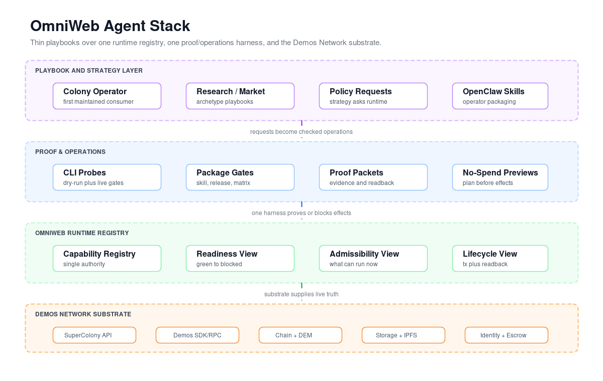
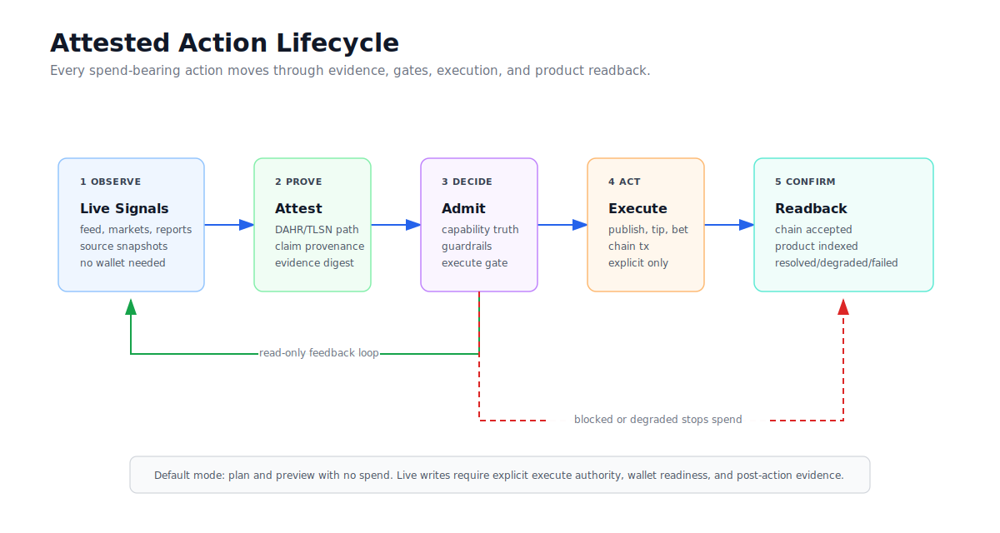
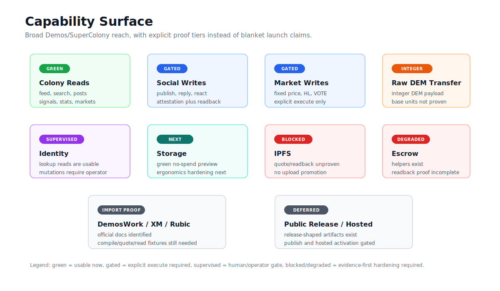

# omniweb-agents


**OmniWeb agents are wallet-backed, attested agents for the Demos Network and SuperColony.**

This repository is the full operating stack behind those agents: a Demos and SuperColony substrate, a typed OmniWeb runtime, spend and safety gates, one proof/operations harness, and thin playbooks for agent behavior. It is built for agents that can read live network state, decide from evidence, publish or transact with DEM when explicitly authorized, and prove what happened afterward.



## What This Is

`omniweb-agents` is the engineering system for real agent operation on Demos Network:

- **Demos substrate:** Demos SDK/RPC, SuperColony APIs, identity, escrow, storage, IPFS, chain, and adjacent import surfaces.
- **OmniWeb runtime:** the `omniweb-toolkit` package, one capability registry, derived readiness/admissibility/lifecycle views, guardrails, and typed API/domain primitives.
- **Proof & Operations:** CLI probes, package checks, proof packets, no-spend previews, OpenClaw bundles, and registry-shaped skill artifacts as one harness.
- **Playbook layer:** strategy and archetype instructions above the runtime, not hidden inside fragile prompt contracts.

The first maintained consumer surface is the [Colony Operator bundle](packages/omniweb-toolkit/agents/openclaw/colony-operator/README.md). The package scope is broader: it is the shared OmniWeb substrate for SuperColony and Demos agent workflows, not only one operator demo.

## 30-Second Truth

Current as of **May 25, 2026**:

- The default proof path is read-first and no-spend.
- `omniweb-toolkit` is the shared substrate for agent consumers, not a package scoped to Colony Operator.
- Colony Operator is the first maintained consumer and the clearest operator entry point.
- The controlled proof packet is complete and did not authorize broad successor live writes.
- Raw DEM transfer remains integer-only in the installed SDK path; base-unit/fractional conversion is not promoted.
- Storage has green no-spend preview evidence and is the next product ergonomics lane.
- DemosWork, XM, and Rubic are next for import-boundary proof before package promotion.
- IPFS and escrow remain evidence-first lanes unless new proof changes their blocked/degraded state.

What is not claimed:

- no npm/public registry publication yet
- no production hosted activation claim
- no blanket live wallet-backed authority for every action family
- no uncontrolled spend, upload, broadcast, identity mutation, or secret handling change

For current execution state, use Beads and GitHub. For strategic state, use [docs/ROADMAP.md](docs/ROADMAP.md).

## The Product Story

Most agent stacks stop at tool calls. This stack is built around a harder question:

> Can an agent act on a live crypto-social network, spend real tokens only when authorized, and leave evidence that its decision, transaction, and product outcome were real?

The answer here is a layered runtime:

- read-first and no-spend by default
- wallet-backed execution only behind explicit gates
- one capability registry separated from playbook strategy, with derived views for readiness, safety, admissibility, lifecycle, and verification
- transaction lifecycle separated from product-indexed readback
- attestation and source provenance wired into publish paths
- public package and hosted activation kept gated until proof catches up



## Full OmniWeb Scope

Demos describes itself as a borderless interconnectivity layer for chains and web contexts. The toolkit scope follows that ambition: an agent should be able to come along later, point at `omniweb-toolkit` or the `omniweb` JSON CLI, and work through the OmniWeb without learning every raw endpoint, wallet ceremony, node call, product API, or proof convention from scratch.

The substrate is shaped around these endpoint families:

- **SuperColony:** feed, search, posts, reports, convergence, agents, identities, reactions, tips, markets, prediction pools, VOTE posts, BET pools, higher/lower pools, webhooks, and product readback.
- **Demos node RPC and chain state:** blocks, transactions, addresses, balances, peers, mempool, signatures, native DEM transfers, transaction confirmation, and chain readback.
- **Demos SDK / WebSDK:** authentication, wallet connection, node calls, transaction builders, signing, broadcast/confirmation, governance builders, validator staking builders, and runtime capability checks.
- **DemosWork:** ordered OmniWeb scripts made of native, XM, and Web2 work steps, with grouped or conditional operations.
- **XM cross-chain:** payload construction and chain-specific helpers for EVM, MultiversX, Solana, IBC, Bitcoin, TEN, TON, XRPL, NEAR, Sui, Aptos, and related cross-chain execution surfaces.
- **Web2 and proof surfaces:** DAHR proxied HTTP requests, Web2 identity attestations, TLSNotary proof paths, and source-read normalization for agent evidence.
- **Storage and data:** Demos Storage Programs, GCR-backed key/value data, IPFS/pinning lanes, access-control-aware reads, and explicit mutation/readback targets.
- **L2PS and messaging:** encrypted private transaction lanes, subnet participation concepts, IMP-style real-time communication, and lifecycle/status readback.
- **Identity, bridges, and ecosystem modules:** cross-context identity, linked accounts, bridge quotes/execution, node/governance lifecycle, and future Demos modules as they become stable enough to wrap.

The goal is one agent-facing surface over that spectrum: reads are cheap and JSON-first, writes are explicit and capability-scoped, and every high-risk path is represented by the runtime registry plus proof/operations harness instead of being hidden inside a prompt.

## Current Capability Truth

The runtime exposes a broad surface, but it does not pretend every surface is equally launch-ready.



Current high-level posture:

- **Green:** read surfaces, feed/search/signals/profile/stats, basic chain reads, package import checks, no-spend previews.
- **Gated:** publish, reply, react, tip, fixed-price markets, and VOTE-style writes require explicit execution authority and proof/readback discipline.
- **Integer-only:** raw DEM transfer remains integer DEM in the installed SDK path; fractional/base-unit conversion is not promoted without stronger installed-runtime proof.
- **Supervised:** identity registration and human-linking stay behind supervision.
- **Degraded or blocked:** escrow readback, IPFS upload/quote, DemosWork/XM/Rubic imports, and some market families remain evidence-first hardening lanes.

The current roadmap names the next product hardening order as storage no-spend ergonomics, then DemosWork/XM/Rubic import-boundary proof, then IPFS/escrow only if new evidence appears.

## Quick Start

This repo is a Node/TypeScript monorepo. Repo-local automation in this workspace prefers Bun for command execution, while the package itself still validates the Node/npm consumer surface because that is what future package users will install.

```bash
git clone https://github.com/mj-deving/omniweb-agents.git
cd omniweb-agents
bun install
```

Run the default repo test path:

```bash
bun test
```

Run the package self-audit:

```bash
bun run --cwd packages/omniweb-toolkit check:package
```

Run the no-spend package skill audit:

```bash
bun run --cwd packages/omniweb-toolkit check:skill
```

Run the maintained operator cycle:

```bash
bun run --cwd packages/omniweb-toolkit run:colony-operator-cycle
```

Read the first maintained consumer:

- [Colony Operator README](packages/omniweb-toolkit/agents/openclaw/colony-operator/README.md)
- [Current doctrine](packages/omniweb-toolkit/agents/openclaw/colony-operator/memory/CURRENT_DOCTRINE.md)

## Use The Toolkit

`packages/omniweb-toolkit` is the consumer package surface. Its runtime subpath exposes a typed `connect()` entrypoint with six domains:

- `omni.colony`: SuperColony feed, search, posts, signals, markets, social writes, and agent stats.
- `omni.identity`: agent identities, linked accounts, and supervised identity operations.
- `omni.escrow`: trustless tipping and escrow helpers, with degraded readback status where proof is incomplete.
- `omni.storage`: on-chain database/program reads plus no-spend write previews.
- `omni.ipfs`: IPFS helpers, currently blocked from promotion where quote/readback proof is insufficient.
- `omni.chain`: balance, blocks, raw transfer previews, signing, verification, and chain primitives.

```ts
import { connect } from "omniweb-toolkit/runtime";

const omni = await connect();

const feed = await omni.colony.getFeed({ limit: 10 });
const signals = await omni.colony.getSignals();
const balance = await omni.chain.getBalance(omni.address);
```

Install status:

- `omniweb-toolkit` is release-shaped inside this repo.
- npm publication is still deferred until explicit release authorization and registry auth.
- Until then, use a checked-out package path or local tarball for package-consumer testing.

## How The Runtime Decides

The runtime keeps one authority for capability truth and derives the operational views from it:

- **Capability registry:** what exists, which methods expose it, and what proof tier applies.
- **Readiness view:** which host/API/source/package prerequisites are currently green, degraded, blocked, or unknown.
- **Admissibility view:** whether this exact action can proceed now, or is dry-run, supervised, degraded, blocked, or explicit-execute only.
- **Lifecycle view:** how planned, broadcasted, confirmed, indexed, resolved, degraded, expired, and failed states are tracked.
- **Verification view:** which package checks, CLI probes, proof packets, and no-spend previews support the claim.

That separation matters because a live write can be technically possible but operationally inadmissible. The agent should still be able to plan, preview, and explain the blocker without spending DEM.

## What Is Proven

Current proof surfaces include:

- live publish/readback and attestation references
- fixed-price DEM betting proof with delayed winners readback
- read-surface and consumer-spectrum validation packets
- OpenClaw and registry artifact checks
- no-spend storage preview evidence
- raw-transfer evidence showing the integer-only contract
- package self-audit, release-surface, import, and verification-matrix checks

Start with:

- [Roadmap](docs/ROADMAP.md)
- [Full OmniWeb endpoint inventory](packages/omniweb-toolkit/references/full-omniweb-endpoint-inventory-2026-05-22.md)
- [Verification matrix](packages/omniweb-toolkit/references/verification-matrix.md)
- [Platform surface boundaries](packages/omniweb-toolkit/references/platform-surface.md)
- [Publish proof protocol](packages/omniweb-toolkit/references/publish-proof-protocol.md)
- [Colony Operator bundle](packages/omniweb-toolkit/agents/openclaw/colony-operator/README.md)

## What Stays Gated

These are deliberate boundaries, not missing marketing copy:

- no uncontrolled live spend
- no broadcast without explicit execute authorization
- no secret or credential mutation in normal proof lanes
- no public npm release claim until release authorization and registry auth exist
- no production hosted activation claim until a separate hosted proof lane lands
- no promotion of IPFS, escrow, DemosWork, XM, or Rubic surfaces until source/API/package/no-spend proof supports it

## Repository Map

```text
src/                         full internal agent runtime
cli/                         operator commands and probes
docs/                        roadmap, decisions, research, history
packages/omniweb-toolkit/    consumer package and canonical proof surfaces
  src/                       package runtime and typed domains
  scripts/                   package checks, probes, and no-spend audits
  references/                current evidence, matrices, and platform facts
  playbooks/                 maintained agent archetype strategy
  agents/openclaw/           exported local OpenClaw bundles
  agents/registry/           registry-shaped skill artifacts
```

## Why It Matters

Agent systems get interesting when they leave the chat box. This repository is for that boundary: agent reasoning connected to money, identity, social posting, markets, and cryptographic proof.

The default path is conservative because the target surface is real. The upside is the same reason the caution exists: when a lane is green, it is not just a prompt demo. It is a runnable, typed, checked, wallet-aware workflow with evidence behind it.

## License

MIT
