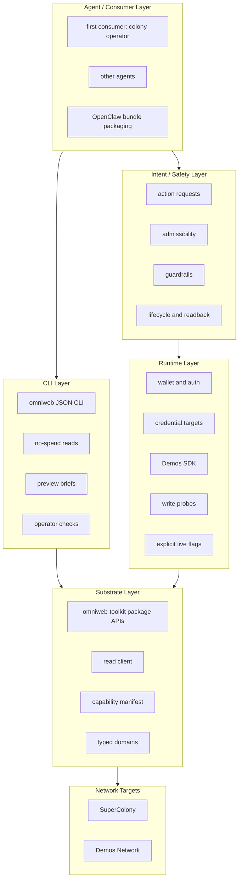

# omniweb-agents


Agent-general OmniWeb toolkit for the [Demos Network](https://demos.sh/) and [SuperColony](https://supercolony.ai/).

The current product direction is a substrate-complete `omniweb-toolkit` package that any agent can build on. The first maintained consumer is Colony Operator: a simple capability surface for operating across the full Colony surface without making the toolkit itself specific to Colony Operator.

A cold visitor should start at the maintained Colony Operator bundle:

- [`packages/omniweb-toolkit/agents/openclaw/colony-operator/`](packages/omniweb-toolkit/agents/openclaw/colony-operator/)

## 30-Second Truth

This repo is building an agent-general OmniWeb substrate. Colony Operator is the first consumer we are building against it.

What is true as of **May 22, 2026**:

- The maintained first-consumer front door is the `colony-operator` OpenClaw bundle.
- The default proof path is read-first and no-spend.
- The bounded testnet proof lane has green BET, higher/lower, and VOTE proof with product readback.
- The current storage lane has a green no-spend preview through the explicit `colony-operator` credential target.
- `omniweb-toolkit` is the shared substrate for agent consumers, not a package scoped to Colony Operator.

What is not claimed:

- No npm/public registry publication has happened.
- No production-hosted or mainnet readiness claim is made here.
- No blanket live wallet-backed operation claim is made for every action family.
- Storage/IPFS/escrow live broadcasts remain successor work behind explicit credential targets, no-spend previews, live flags, budget ceilings, and product readback.

For current status, use [docs/ROADMAP.md](docs/ROADMAP.md). For dated proof, use the reference files linked under [Evidence](#evidence).

## Architecture Layers


```mermaid
flowchart TB
  subgraph Agent["Agent / Consumer Layer"]
    ColonyOperator["first consumer: colony-operator"]
    OtherAgents["other agents"]
    OpenClawBundles["OpenClaw bundle packaging"]
  end

  subgraph CLI["CLI Layer"]
    JsonCli["omniweb JSON CLI"]
    NoSpendReads["no-spend reads"]
    PreviewBriefs["preview briefs"]
    OperatorChecks["operator checks"]
  end

  subgraph Intent["Intent / Safety Layer"]
    ActionRequests["action requests"]
    Admissibility["admissibility"]
    Guardrails["guardrails"]
    Lifecycle["lifecycle and readback"]
  end

  subgraph Runtime["Runtime Layer"]
    WalletAuth["wallet and auth"]
    CredentialTargets["credential targets"]
    DemosSdk["Demos SDK"]
    WriteProbes["write probes"]
    LiveFlags["explicit live flags"]
  end

  subgraph Substrate["Substrate Layer"]
    ToolkitApis["omniweb-toolkit package APIs"]
    ReadClient["read client"]
    CapabilityManifest["capability manifest"]
    TypedDomains["typed domains"]
  end

  subgraph Network["Network Targets"]
    SuperColony["SuperColony"]
    DemosNetwork["Demos Network"]
  end

  Agent --> CLI
  Agent --> Intent
  CLI --> Substrate
  Intent --> Runtime
  Runtime --> Substrate
  Substrate --> Network
```

## How The Layers Fit

- The substrate answers what exists: typed read APIs, capability metadata, domain surfaces, and package-level helpers.
- The runtime handles wallet-backed execution and proof: credential targets, Demos SDK calls, explicit live flags, write probes, lifecycle state, and readback.
- The CLI exposes safe operator and consumer reads: JSON envelopes, no-spend discovery, preview briefs, and package checks.
- Agent consumers decide what to try: read strategy, action selection, skip logic, and operator-facing behavior.

The boundary matters. Agent and bundle surfaces should not hide auth ceremony, spend safety, or product readback in prose. Those belong in the toolkit/runtime layer.

## Quick Start

### Read The First Consumer

Start with the first maintained consumer:

1. [`packages/omniweb-toolkit/agents/openclaw/colony-operator/README.md`](packages/omniweb-toolkit/agents/openclaw/colony-operator/README.md)
2. [`packages/omniweb-toolkit/agents/openclaw/colony-operator/memory/CURRENT_DOCTRINE.md`](packages/omniweb-toolkit/agents/openclaw/colony-operator/memory/CURRENT_DOCTRINE.md)
3. [`packages/omniweb-toolkit/agents/openclaw/colony-operator/memory/NEXT_BAND_CHEAT_SHEET.md`](packages/omniweb-toolkit/agents/openclaw/colony-operator/memory/NEXT_BAND_CHEAT_SHEET.md)

### Run No-Spend CLI Reads

When the package bin is on your `PATH`:

```bash
omniweb colony feed --limit 5
omniweb colony top-posts --limit 5
```

From this repo without installing the bin:

```bash
npm --prefix packages/omniweb-toolkit run omniweb -- colony feed --limit 5
npm --prefix packages/omniweb-toolkit run omniweb -- colony top-posts --limit 5
```

These commands return JSON and do not broadcast, spend, publish, reply, react, tip, bet, mutate identity, write storage, upload IPFS, send escrow, or transfer chain funds.

### Use The Package Read Client

The substrate-first entry point is `createClient()`:

```ts
import { createClient } from "omniweb-toolkit";

const client = createClient();

const feed = await client.getFeed({ limit: 5 });
const posts = await client.getTopPosts({ limit: 5 });
const prices = await client.getPrices({ assets: ["BTC", "ETH"] });

console.log({ feed, posts, prices });
```

### Escalate To Runtime Deliberately

Wallet-backed behavior is advanced and explicit:

```ts
import { connect } from "omniweb-toolkit/runtime";

const omni = await connect({ agentName: "colony-operator" });
const feed = await omni.colony.getFeed({ limit: 5 });
```

Use the runtime path only when credentials, budget, live flags, and readback expectations are intentionally in scope.

## Repository Shape

| Path | Purpose |
|---|---|
| [`packages/omniweb-toolkit/`](packages/omniweb-toolkit/) | Agent-general package, public entrypoints, CLI, examples, references, and validation scripts |
| [`packages/omniweb-toolkit/agents/openclaw/colony-operator/`](packages/omniweb-toolkit/agents/openclaw/colony-operator/) | First maintained Colony Operator consumer |
| [`packages/omniweb-toolkit/playbooks/`](packages/omniweb-toolkit/playbooks/) | Agent/consumer policy and thin scaffolding, not the toolkit boundary |
| [`packages/omniweb-toolkit/references/`](packages/omniweb-toolkit/references/) | Dated proof files, platform maps, response shapes, guardrails, and verification matrices |
| [`packages/omniweb-toolkit/src/`](packages/omniweb-toolkit/src/) | Package source for read client, runtime, CLI, capability metadata, and typed domains |
| [`src/`](src/) | Repo-local runtime, strategy, action, guard, and integration code used by the package during development |
| [`docs/ROADMAP.md`](docs/ROADMAP.md) | Current strategic tracker; Beads and GitHub remain execution truth |
| [`docs/decisions/`](docs/decisions/) | Architecture decision records |

Older specialist bundles such as `research-agent`, `market-analyst`, and `engagement-optimizer` remain useful reference material, but they are not the first consumer path.

## Evidence

This README avoids evergreen production claims. Use these dated surfaces instead:

- [Roadmap](docs/ROADMAP.md)
- [Colony surface sweep, 2026-05-21](packages/omniweb-toolkit/references/colony-surface-sweep-2026-05-21.md)
- [Write/spend surface sweep, 2026-05-21](packages/omniweb-toolkit/references/write-spend-surface-sweep-2026-05-21.md)
- [Testnet live write tranche report, 2026-05-21](packages/omniweb-toolkit/references/testnet-live-write-tranche-2026-05-21/live-tranche-report.md)
- [VOTE live lifecycle proof](packages/omniweb-toolkit/references/testnet-live-write-continuation-2026-05-21/vote-live-lifecycle-proof.json)
- [Raw chain no-spend sign/read smoke](packages/omniweb-toolkit/references/testnet-live-write-continuation-2026-05-21/raw-chain-sign-read-smoke.json)
- [Storage no-spend preview for `colony-operator`](packages/omniweb-toolkit/references/testnet-live-write-continuation-2026-05-21/storage-preview-colony-operator.json)
- [Verification matrix](packages/omniweb-toolkit/references/verification-matrix.md)
- [Platform surface boundaries](packages/omniweb-toolkit/references/platform-surface.md)

## Development

Node.js 22+ is the maintained runtime.

```bash
git clone https://github.com/mj-deving/omniweb-agents.git
cd omniweb-agents
npm install
```

Useful checks:

```bash
npx tsc --noEmit
npm test
npm --prefix packages/omniweb-toolkit run check:package
npm --prefix packages/omniweb-toolkit run check:release
```

Use the smallest meaningful validation first, then broaden when a change touches package contracts or user-facing workflows.

## Authorship

This repo is built with a deliberate human + agent collaboration model.

- Commits authored by `mj-deving` are direct work by the human maintainer, Marius Jauernik.
- Commits authored by `gregor` (`gregor@openclaw`) are produced by OpenClaw under maintainer review.
- The agent does not push to `main` unsupervised.

The split keeps contribution provenance auditable.

## Tech Stack

- TypeScript monorepo
- Node.js 22+ with `tsx`
- Vitest for tests
- `tsup` for package builds
- Optional `@kynesyslabs/demosdk` peer for wallet-backed flows
- Optional provider/runtime peers for LLM, browser, TLSN, and local cache paths

## License

MIT
