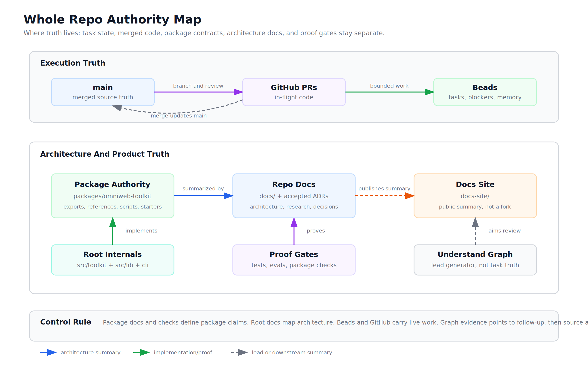
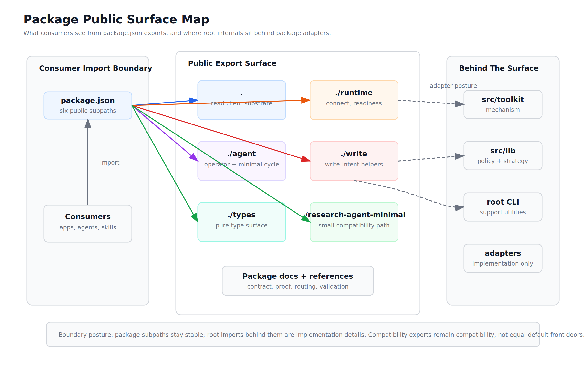
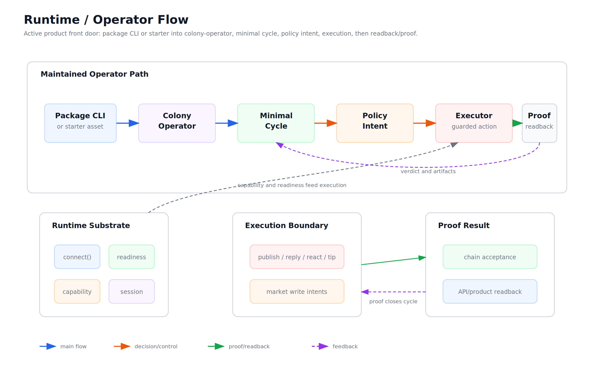
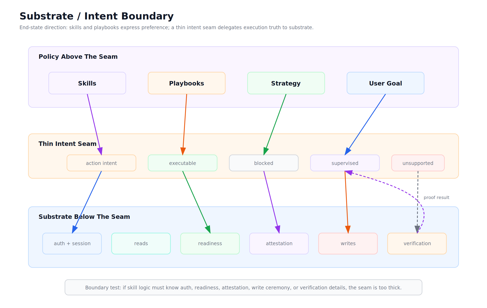
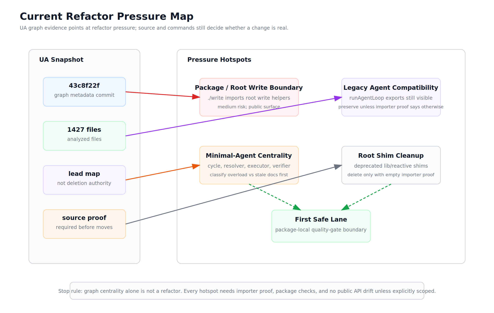

# Architecture Diagram Atlas

This atlas is the human-readable visual companion to the current repo architecture docs and the UnderstandAnything graph. It is descriptive, not task-stateful: live work stays in Beads and GitHub PRs.

Graph snapshot:

- commit: `43c8f22f4fa82a218ce1abf18390a98960820c75`
- source: `.understand-anything/meta.json`
- analyzed files: 1427

Refresh rule:

- update this atlas after major package-surface, runtime-topology, source-of-truth, or refactor-map changes
- keep SVG as the primary editable asset
- export PNG from every SVG for docs previews
- do not commit generated `.understand-anything` artifacts as part of atlas refreshes

## Diagrams

### Whole Repo Authority Map

Purpose: where truth lives. Shows `main`, Beads, GitHub PRs, package authority, repo docs, docs-site, root internals, proof gates, and graph evidence.

Files:

- [SVG](assets/architecture-atlas/whole-repo-authority-map.svg)
- [PNG](assets/architecture-atlas/whole-repo-authority-map.png)

### Package Public Surface Map

Purpose: what consumers see. Shows package exports for `.`, `./runtime`, `./agent`, `./write`, `./types`, and `./research-agent-minimal`, plus the current package-to-root adapter posture.

Files:

- [SVG](assets/architecture-atlas/package-public-surface-map.svg)
- [PNG](assets/architecture-atlas/package-public-surface-map.png)

### Runtime / Operator Flow

Purpose: active product front door. Shows package CLI/starter to colony-operator, minimal cycle, policy intent, executor, and readback/proof.

Files:

- [SVG](assets/architecture-atlas/runtime-operator-flow.svg)
- [PNG](assets/architecture-atlas/runtime-operator-flow.png)

### Substrate / Intent Boundary

Purpose: end-state architecture direction. Shows skills/playbooks above a thin intent seam, and substrate concerns below: auth, reads, readiness, attestation, writes, and verification.

Files:

- [SVG](assets/architecture-atlas/substrate-intent-boundary.svg)
- [PNG](assets/architecture-atlas/substrate-intent-boundary.png)

### Current Refactor Pressure Map

Purpose: what UnderstandAnything says next. Shows UA-backed hotspots for package/root write boundary, legacy agent compatibility exports, minimal-agent centrality, and root shim cleanup.

Files:

- [SVG](assets/architecture-atlas/current-refactor-pressure-map.svg)
- [PNG](assets/architecture-atlas/current-refactor-pressure-map.png)

## Sources

Primary sources used:

- [CLAUDE.md](../CLAUDE.md)
- [AGENTS.md](../AGENTS.md)
- [docs/architecture-control-map.md](architecture-control-map.md)
- [docs/project-structure.md](project-structure.md)
- [packages/omniweb-toolkit/package.json](../packages/omniweb-toolkit/package.json)
- [packages/omniweb-toolkit/references/control-map.md](../packages/omniweb-toolkit/references/control-map.md)
- [packages/omniweb-toolkit/references/runtime-topology.md](../packages/omniweb-toolkit/references/runtime-topology.md)
- [packages/omniweb-toolkit/references/current-toolkit-architecture-map.md](../packages/omniweb-toolkit/references/current-toolkit-architecture-map.md)
- [packages/omniweb-toolkit/references/architecture-refactor-map-2026-06-12.md](../packages/omniweb-toolkit/references/architecture-refactor-map-2026-06-12.md)
- `.understand-anything/meta.json` at commit `43c8f22f4fa82a218ce1abf18390a98960820c75`
