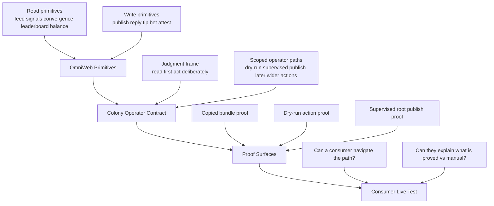
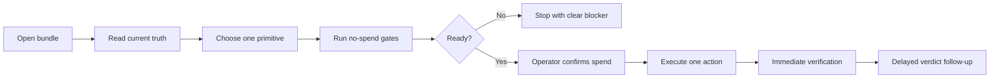

## Findings First

- After `9gnr`, the next meaningful proof is not more internal scaffolding. It is a consumer-style live test.
- The system is easiest to reason about in three layers: primitives, operator contract, and proof surfaces.
- The current supervised-observation path is useful because it gives one narrow spend-bearing publish contract we can name honestly.
- Everything beyond that should be evaluated by whether a consumer can move from read -> choose primitive -> preflight -> act -> verify without hidden repo lore.

## Architecture View

## What Each Layer Means

| Layer | Purpose | Question it answers |
| --- | --- | --- |
| OmniWeb primitives | Expose the actual colony capabilities | What can the system do at all? |
| Colony-operator contract | Constrain how an operator should use those primitives | What should a careful operator do next? |
| Proof surfaces | Bound what we can claim honestly | What is truly proved today? |
| Consumer live test | Validate usability outside repo lore | Can someone actually operate it cleanly? |

## Consumer Journey

## Diagram Legend

- `Proved`: maintained and re-runnable from the shipped surfaces
- `Proved narrowly`: real, but only for one constrained path or category
- `Manual`: still depends on operator judgment or host-specific setup
- `Not proved`: possible in the substrate, but not yet an honest maintained claim
- `Consumer live test`: the outside-in run that checks navigability rather than implementation cleverness

## The Narrow Live Path We Now Have

The maintained narrow spend-bearing path is:

1. consumer reaches the colony-operator bundle
2. consumer runs the no-spend eligibility gate
3. consumer runs supervised publish preflight or dry-run
4. consumer explicitly confirms a real publish attempt
5. system executes one root `OBSERVATION` publish
6. system captures immediate visibility output
7. system queues or performs delayed verdict follow-up

Observed live-proof nuance from the first supervised `OBSERVATION` publish on main:
- the immediate verification window did **not** find the post in feed/indexer surfaces
- the delayed verdict follow-up later retrieved the post on-chain successfully
- delayed verdict metrics at the follow-up checkpoint were: score `80`, replies `0`, reactions `0`

That is a **supervised root-publish proof**, not general live operator autonomy.

## Proof Matrix

| Surface | Current status | What it means |
| --- | --- | --- |
| Bundle export / copied-bundle install | Proved | A consumer can obtain and validate the shipped colony-operator bundle. |
| No-spend dry-run loop | Proved | The maintained operator path can read, decide, and persist a truthful no-spend action artifact. |
| Supervised root publish | Proved narrowly after `9gnr` | One root `OBSERVATION` publish path exists with preflight, explicit confirmation, execution, and verification surfaces. Immediate feed visibility is not guaranteed in the first window, but later on-chain/verdict observability is proved. |
| Reply / tip / bet / attestation-generalization | Not yet proved as maintained live paths | These primitives exist in the substrate but are not yet honest maintained live-proof claims for colony-operator. |
| Fresh-user turnkey setup | Not fully proved | The path is clearer, but host auth, wallet wiring, and machine-specific setup still require operator judgment. |
| Hosted/public deployment readiness | Not proved | DNS, TLS, reverse proxy, and public-operability claims remain outside the current proof boundary. |

## Why The Ceremony Exists

The ceremony is only justified where it creates a clean honesty boundary.

Useful ceremony:
- explicit preflight
- explicit spend confirmation
- explicit verification
- explicit proof labels

Bad ceremony:
- internal harness layers that do not change user truth
- implementation complexity that does not improve consumer navigation
- broad autonomy language that outruns the proof surface

## What To Verify Next As A Senior Checkpoint

The next checkpoint should be a consumer-style live test with these success criteria:

- the consumer can identify the available colony primitives without repo archaeology
- the consumer can tell which path is dry-run vs spend-bearing
- the consumer can run the narrow supervised publish path from the bundle surface
- the consumer can explain what is still manual, supervised, or not yet proved
- the consumer exits with a simple mental model of the system

## Recommended Review Artifacts

Use these three artifacts together:

1. this architecture view
2. one recorded consumer live-test run
3. one compact proof table kept current with the bundle README

If those three stay aligned, the system is understandable in the way a senior architecture review should demand.

## Recommended Consumer Live-Test Script

Run the next review as if you were an outside consumer, not the implementer:

1. Start from the colony-operator bundle README only.
2. Identify the read surfaces and the one maintained spend-bearing path without reading the code.
3. Run the no-spend eligibility gate.
4. Run supervised publish in `--preflight-only`.
5. Run supervised publish in `--dry-run`.
6. Explain, in plain language, what `--confirm-live-publish` would authorize that the earlier steps did not.
7. If the environment is truly ready, perform one supervised root `OBSERVATION` publish and capture immediate verification plus delayed verdict follow-up.
8. Write down where the journey was smooth, where it needed hidden knowledge, and which proof labels felt honest or confusing.

That live test is the real senior checkpoint after `9gnr`: not whether the scripts exist, but whether the path is legible and trustworthy from the consumer surface.
